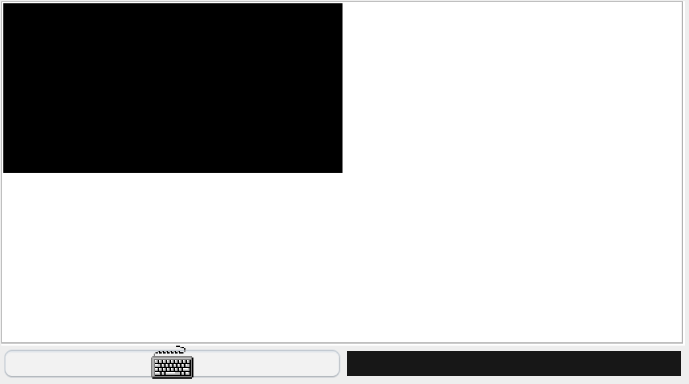
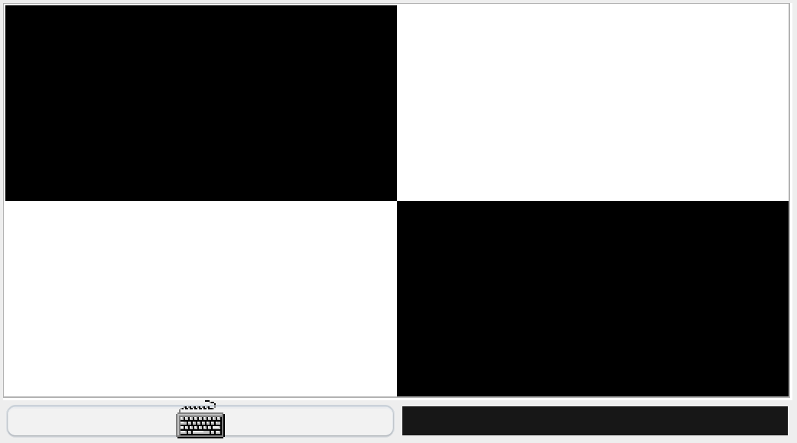
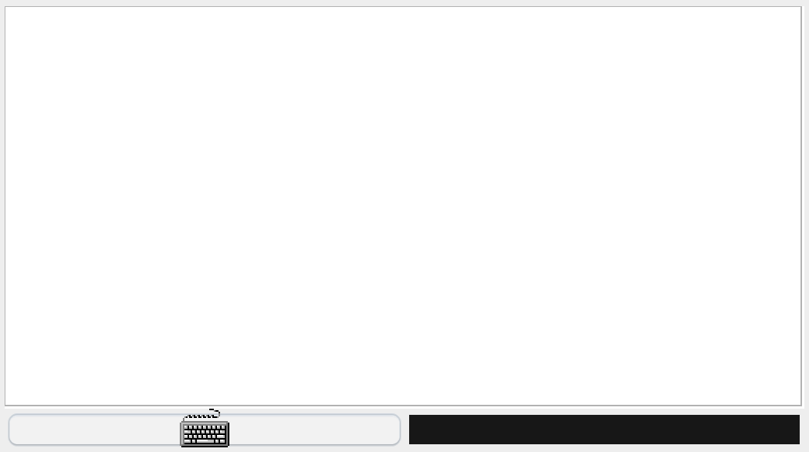

# Evaluación de la Unidad 1 - Lenguaje de máquina

En este reto, debes realizar varias tareas que te iré explicando por partes:

## Manejo de teclado

En esta parte, debes implementar un bucle infinito que monitoree constantemente el estado del teclado en el emulador de CPU Hack de Nand2Tetris. La ejecución del programa debe permanecer en este bucle de manera continua, y solo se permitirá salir cuando se detecte la presión de alguna de las teclas designadas: **A, B o C**. Este bucle actúa como el núcleo de control que espera activamente la interacción del usuario y desencadenará las acciones correspondientes según la tecla presionada.

## Rutina para Pintar la Esquina Superior Izquierda al Presionar la Tecla A

Cuando se presiona la **tecla A**, la rutina debe pintar la esquina superior izquierda de la pantalla. La figura 1 muestra una imagen de ejemplo de lo que se solicita. Deben tener en cuenta la estructura de la pantalla, donde cada registro corresponde a 16 pixeles y la pantalla tiene 512 pixeles de ancho y 256 pixeles de alto, la tarea implica manipular los registros adecuados para representar exactamente la mitad superior izquierda de la pantalla.En términos prácticos, la rutina debe comenzar en el primer registro de la pantalla (16384) y avanzar horizontalmente y verticalmente hasta la mitad de la misma.

    

Figura1. Cuando se presiona la tecla A.

## Rutina para Pintar la Esquina Inferior Derecha al Presionar la Tecla B

Cuando la tecla B es presionada, la rutina debe pintar la esquina inferior derecha de la pantalla. Observe la figura 2, para que tenga una idea del resultado que debe obtener. Considerando que la pantalla tiene 512 pixeles de ancho y 256 pixeles de alto, y cada registro representa 16 pixeles, la tarea implica manipular los registros apropiados para representar exactamente la mitad inferior derecha de la pantalla.

    

Figura2. Cuando se presiona la tecla B.

## Rutina para Borrar Completa la Pantalla al Presionar la Tecla C

Cuando la tecla C es presionada, la tarea asignada implica la creación de una rutina que logre el borrado completo de la pantalla. En la figura 3 se observa, como es de esperarse, la pantalla nuevamente limpia. En este contexto, el "borrado" implica establecer todos los bits de todos los registros de la pantalla en cero, dejando la pantalla completamente en blanco.

    

Figura3. Cuando se presiona la tecla C.
